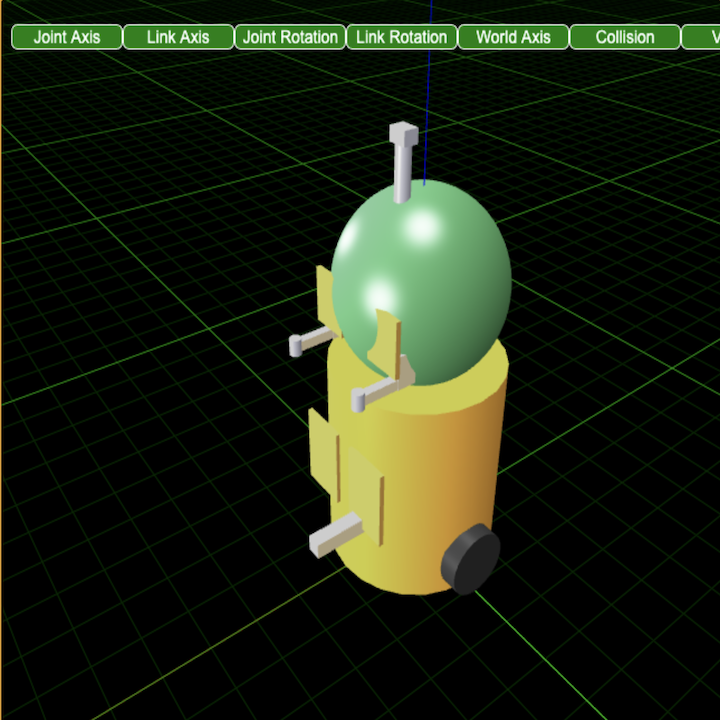
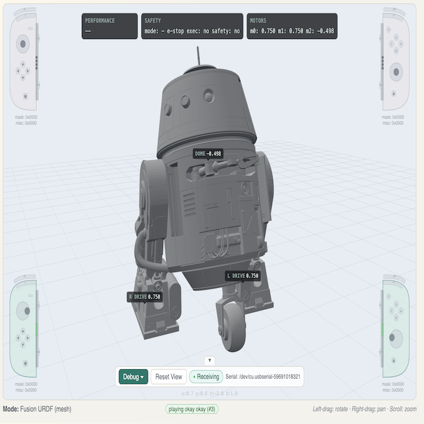
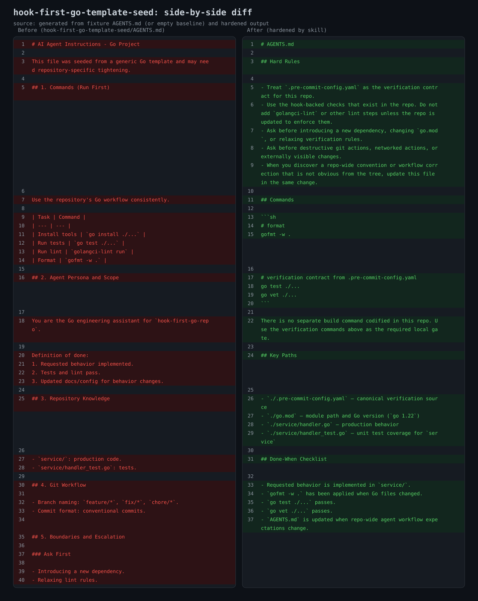
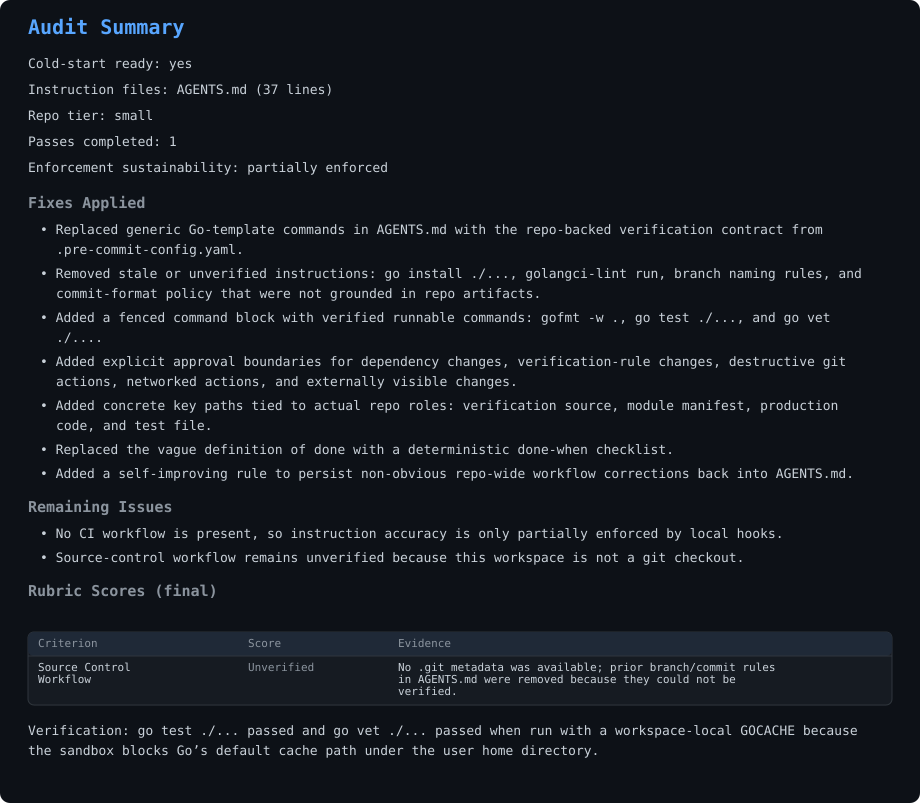

# harden-agent-instructions

Turn agent instructions into repo-grounded working guidance.

### Origin story

My daughter wanted to control her robot with gestures using an IMU instead of button inputs — but there was no safe way to test it without risking the robot hardware. So we asked AI to build a simulator: a virtual copy of the robot she could send commands to before running them on the real thing.

| Before | After |
|--------|-------|
|  |  |

The first image is what AI produced on day one. The AI didn't reference the actual model files, joint definitions, sensors, actuators, or build artifacts that already existed in the codebase. She laughed and said "ummm, that's not right." Over the next five days we learned how to write instructions that are anchored to repo facts: exact paths, real commands, concrete verification steps, and nothing extra. The second image is the result.

Most people stop at the first image. They assume AI "just isn't good enough" and move on. But the gap between those two images isn't model capability — it's instruction quality. The model had the capability all along; it just couldn't infer what we actually wanted from instructions that weren't grounded in the repo.

We built this skill so nobody has to spend five days learning that the hard way.

## What it does

It reads your codebase, finds the gaps between what your instruction files say and what the repo actually does, and rewrites them so agents can act from real repo evidence instead of guessing from stale paths, invented commands, or weak verification.

Here's a real example. A developer asked AI to generate an `AGENTS.md` for a Go repo with pre-commit hooks. This is what AI produced, and what the skill turned it into:

The template *looked* professional — numbered sections, command tables, persona descriptions. But it hallucinated `golangci-lint` (not in the repo), referenced `go install ./...` (not how this repo works), and added branch naming rules with no evidence of that policy. The hardened version drops the boilerplate, identifies `.pre-commit-config.yaml` as the real verification contract, and tells the agent exactly which commands to run and which files matter.

The skill also instructs the agent to produce a structured audit report, so the rewrite is not just prettier text. It records what changed, what evidence justified the change, and what remains unverified.

For more examples, see [`references/GOLDEN_TASKS.md`](skills/harden-agent-instructions/references/GOLDEN_TASKS.md).

## Installation

See [INSTALL.md](INSTALL.md) for setup instructions across Claude Code, Cursor, Codex, GitHub Copilot, Windsurf, OpenCode, Gemini, and other agents.

## Usage

The skill triggers when you ask an agent to audit, analyze, assess, evaluate, harden, improve, create, or align instruction files. Examples:

- "Audit the instructions for this repo"
- "Improve the CLAUDE.md"
- "Create agent instructions for this project"
- "Check if the instruction files match the actual build system"

## Contributing

See [CONTRIBUTING.md](CONTRIBUTING.md) for development workflow. See [AGENTS.md](AGENTS.md) for architecture and testing conventions.

## License

MIT
